# touchlog Scenario Diagrams

This document contains Mermaid diagrams visualizing the scenarios defined in `SCENARIOS.md`. The diagrams are organized by feature file, with overview diagrams for simpler features and detailed diagrams for complex scenarios.

---

## features/platform.feature

### Platform Support Flow

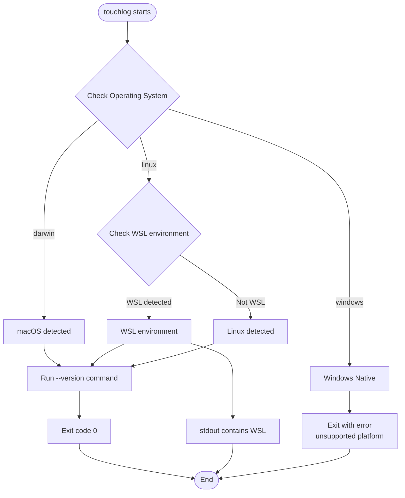

---

## features/cli.feature

### CLI Command Routing

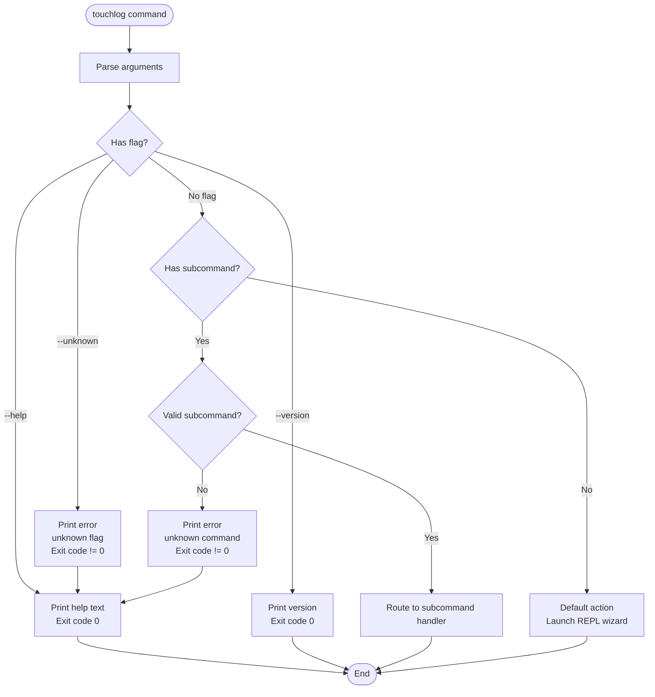

---

## features/config.feature

### Configuration Loading and Precedence

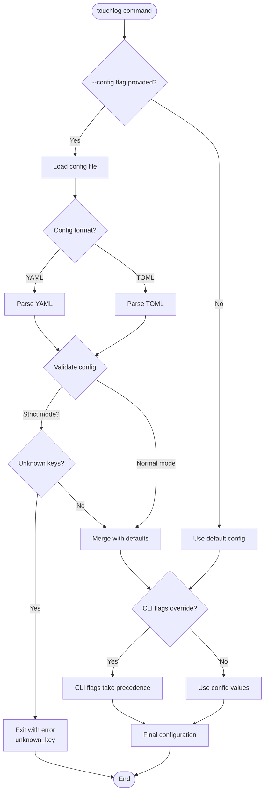

---

## features/templates.feature

### Template Selection and Application

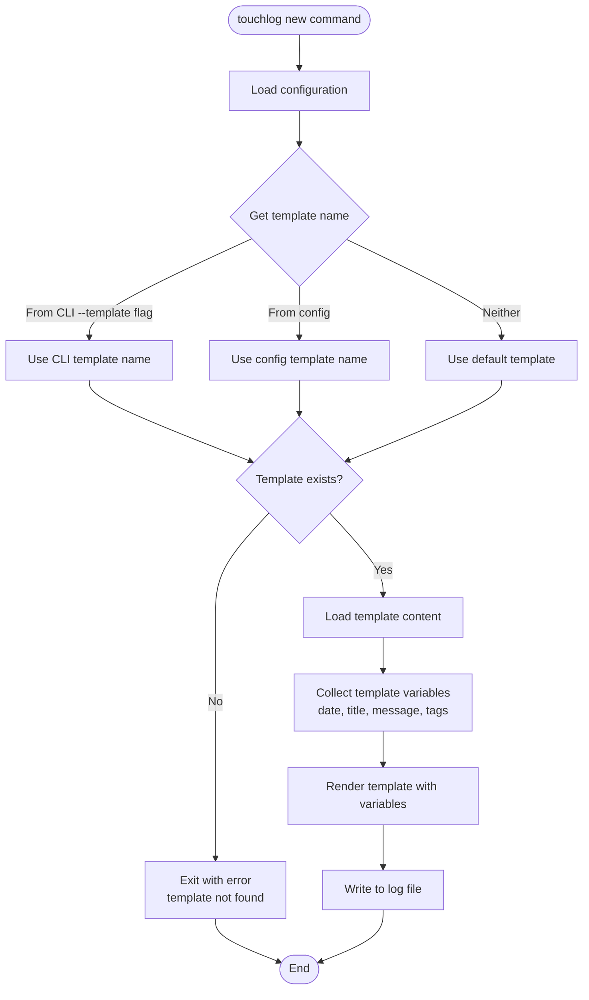

---

## features/new.feature

### Non-Interactive Log Entry Creation Flow

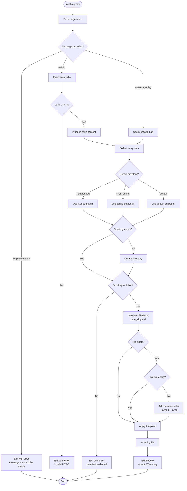

---

## features/editor.feature

### Editor Resolution and Launch Sequence

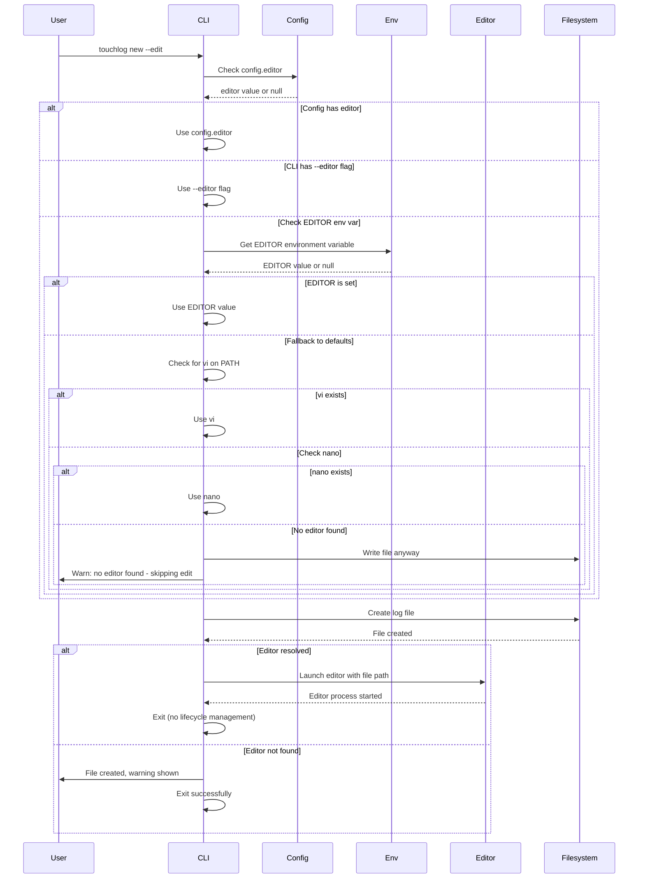

### Editor Precedence Decision Tree

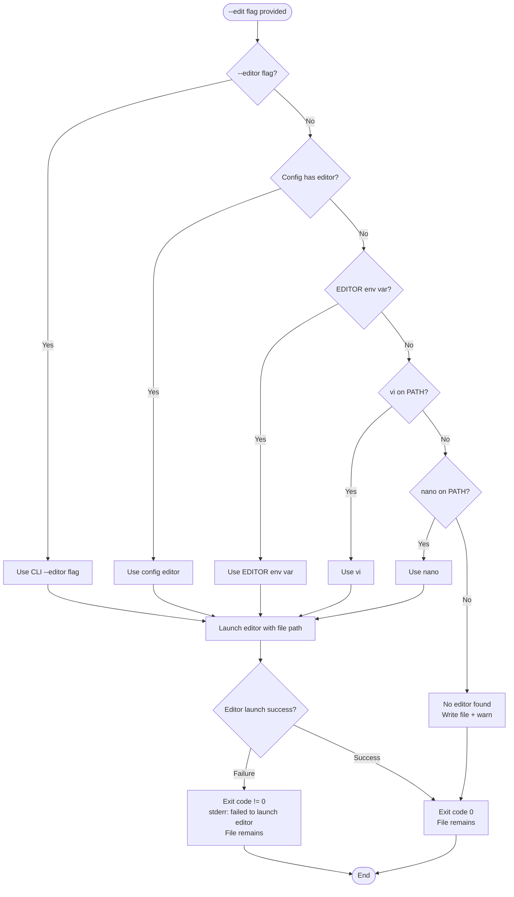

---

## features/repl_wizard.feature

### REPL Wizard State Machine

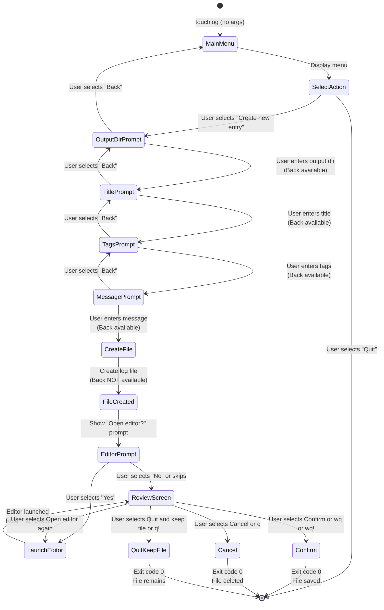

### REPL Wizard Detailed Flow

```mermaid
flowchart TD
    Start([touchlog]) --> MainMenu[Main Menu<br/>Select an action]
    
    MainMenu --> UserInput1{User input}
    UserInput1 -->|1 - Create new entry| OutputDirStep[Output Directory Prompt]
    UserInput1 -->|Quit| Exit([Exit])
    
    OutputDirStep --> UserInput2{User input}
    UserInput2 -->|Enter path| ValidatePath{Path valid?}
    UserInput2 -->|Back| MainMenu
    UserInput2 -->|Use default| TitleStep[Title Prompt]
    
    ValidatePath -->|No| ShowError1[Show error<br/>Stay on step]
    ValidatePath -->|Yes| TitleStep
    ShowError1 --> UserInput2
    
    TitleStep --> UserInput3{User input}
    UserInput3 -->|Enter title| TagsStep[Tags Prompt]
    UserInput3 -->|Back| OutputDirStep
    UserInput3 -->|Skip| TagsStep
    
    TagsStep --> UserInput4{User input}
    UserInput4 -->|Enter tags| MessageStep[Message Prompt]
    UserInput4 -->|Back| TitleStep
    UserInput4 -->|Skip| MessageStep
    
    MessageStep --> UserInput5{User input}
    UserInput5 -->|Enter message| CreateFile[Create Log File]
    UserInput5 -->|Back| TagsStep
    UserInput5 -->|Skip| CreateFile
    
    CreateFile --> FileExists{File created?}
    FileExists -->|Yes| ShowCreated[Show created file path]
    FileExists -->|No| FileError[File creation error]
    
    ShowCreated --> EditorPrompt[Editor Prompt<br/>Open editor now?]
    EditorPrompt --> UserInput6{User input}
    
    UserInput6 -->|1 - Yes| LaunchEditor[Launch Editor]
    UserInput6 -->|2 - No| ReviewScreen[Review Summary Screen]
    
    LaunchEditor --> EditorLaunched{Editor launched?}
    EditorLaunched -->|Success| ReviewScreen
    EditorLaunched -->|Failure| ReviewScreen
    
    ReviewScreen --> ShowOptions["Show Options<br/>1) Open editor again<br/>2) Confirm<br/>3) Cancel<br/>4) Quit and keep file<br/>Also wq, wq!, q, q!"]
    
    ShowOptions --> UserInput7{User input}
    
    UserInput7 -->|1 or Open editor| LaunchEditor
    UserInput7 -->|2 or wq or wq!| Confirm[Confirm - Save & Exit]
    UserInput7 -->|3 or q| Cancel[Cancel - Delete & Exit]
    UserInput7 -->|4 or q!| QuitKeep[Quit - Keep File]
    
    Confirm --> Success[Exit code 0<br/>File saved]
    Cancel --> DeleteFile[Delete file]
    QuitKeep --> Success2[Exit code 0<br/>File remains]
    
    DeleteFile --> Success3[Exit code 0<br/>File deleted]
    
    FileError --> End([End])
    Success --> End
    Success2 --> End
    Success3 --> End
    Exit --> End
```

---

## features/repl_ui.feature

### REPL TUI Rendering and Interaction

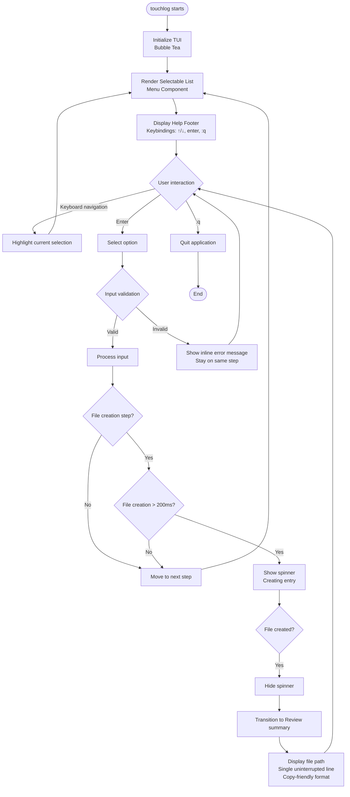

---

## features/metadata.feature

### Metadata Capture and Enrichment Flow

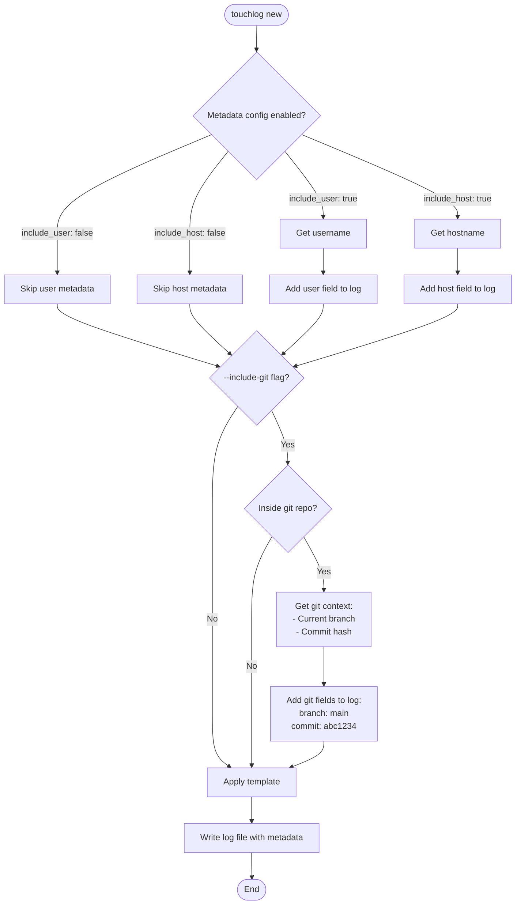

---

## features/errors.feature

### Error Handling and Safe Behavior

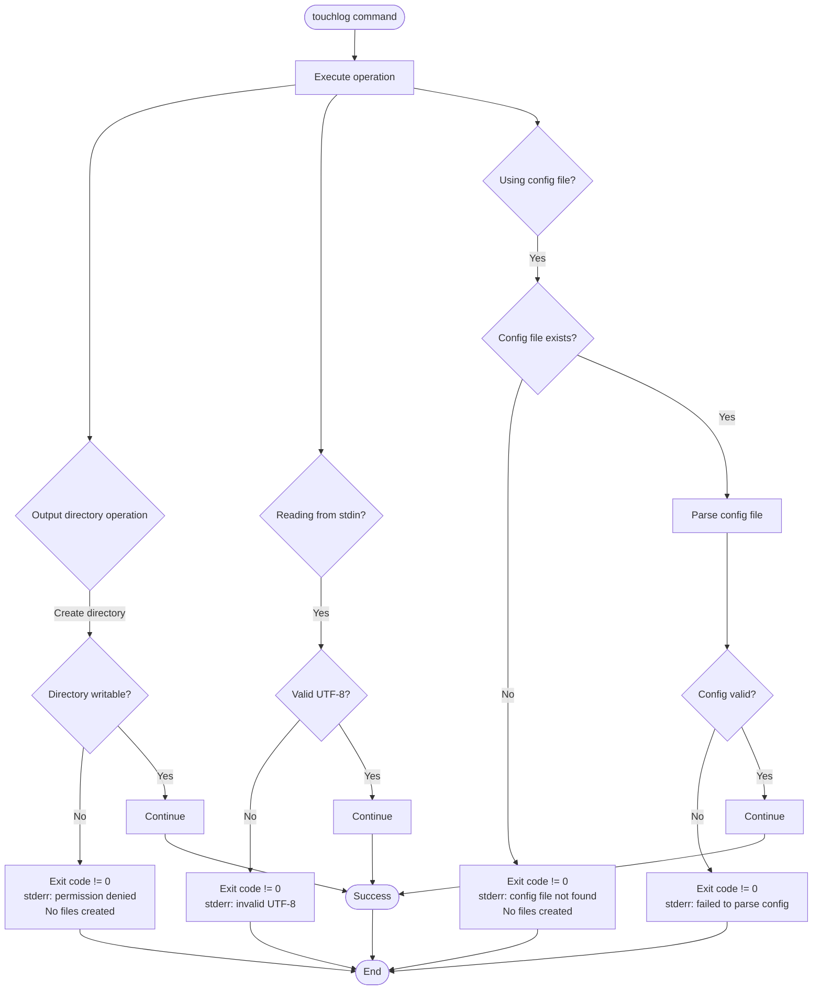

---

## features/list_search.feature (Future)

### List and Search Operations Flow

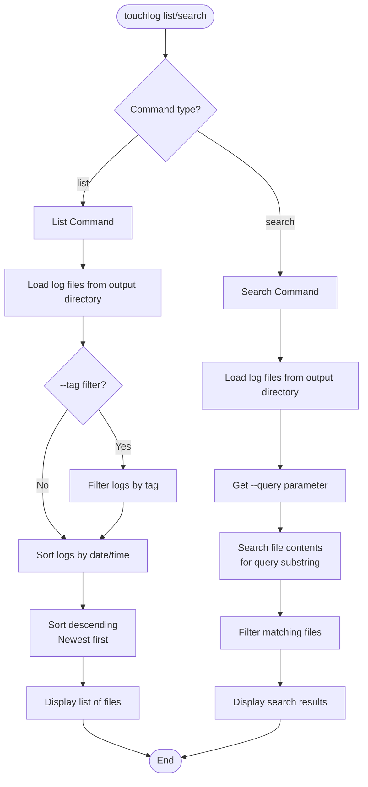

---

## Cross-Feature Integration Overview

### Complete touchlog Command Flow

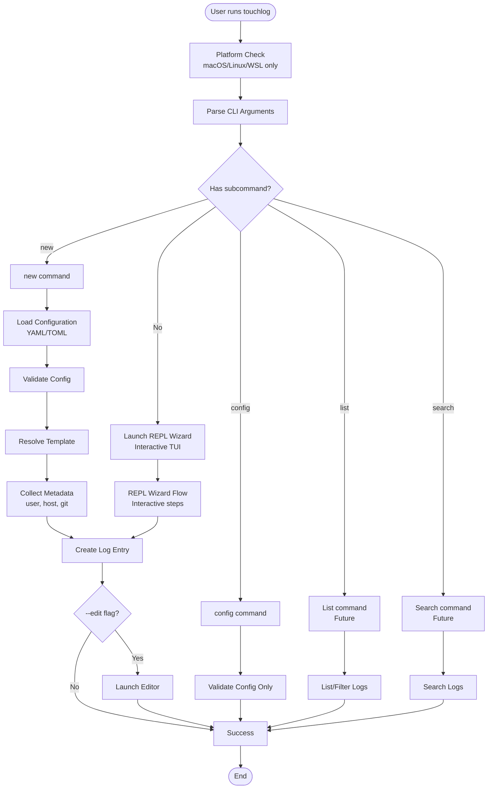

---

## Summary

This document provides visual representations of all scenarios defined in `SCENARIOS.md`:

- **Platform**: Simple platform detection flow
- **CLI**: Command routing and flag handling
- **Config**: Configuration loading with precedence rules
- **Templates**: Template selection and rendering
- **New**: Detailed non-interactive entry creation
- **Editor**: Editor resolution with fallback chain
- **REPL Wizard**: Complex state machine and detailed flow
- **REPL UI**: TUI rendering and interaction patterns
- **Metadata**: Metadata capture and enrichment
- **Errors**: Error handling and safe behavior
- **List/Search**: Future list and search operations

Each diagram type (flowchart, sequence, state diagram) is chosen based on what best represents the scenario's behavior and interactions.
